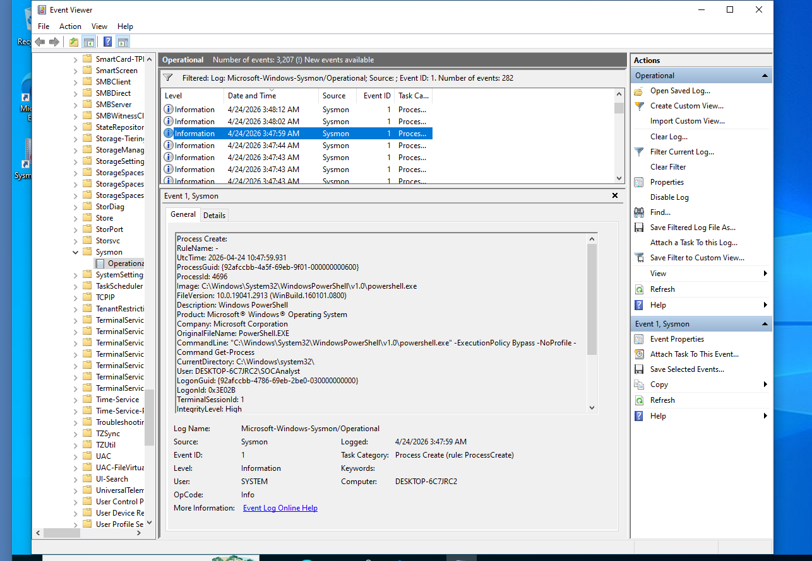

# Investigation Report

## Alert

PowerShell execution detected.

---

## Event Source

Microsoft-Windows-Sysmon/Operational

Event ID: 1

Task Category:
Process Create

---

## Evidence

### Screenshot 1

PowerShell command execution.

---

### Screenshot 2

Sysmon Event ID 1.

---

## Command Line Observed

powershell.exe -ExecutionPolicy Bypass -NoProfile

---

## Analysis

The command launched PowerShell while bypassing local execution policy restrictions.

Attackers frequently use this flag to execute scripts that would otherwise be blocked.

No evidence of:

- Encoded commands
- Download activity
- External script execution

was observed.

---

## Risk Assessment

Severity: Low

---

## Conclusion

PowerShell ExecutionPolicy Bypass was successfully detected through Sysmon Event ID 1.

Activity appears consistent with authorized administrative testing performed in a lab environment.
