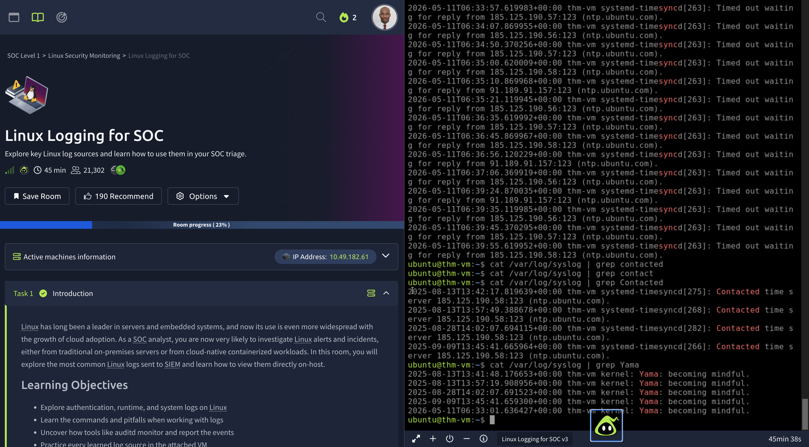

# Linux Logging for SOC

## Platform

TryHackMe

## Difficulty

Beginner

## Objective

Learn how Linux logs are generated, stored, and analyzed from a SOC analyst perspective.

## Skills Demonstrated

- Linux Log Analysis
- Syslog Investigation
- grep Usage
- Threat Hunting
- Linux Command Line
- Log Source Identification

## Tools Used

- Linux Terminal
- Syslog
- grep

## Key Concepts Covered

- /var/log/syslog
- Authentication Logs
- System Logs
- Kernel Logs
- Log Filtering
- Event Searching

## Evidence

See screenshots folder for supporting evidence.

## Outcome

Successfully completed the room and identified relevant events using Linux log analysis techniques commonly used by SOC analysts.

## Screenshots

### Room Overview

